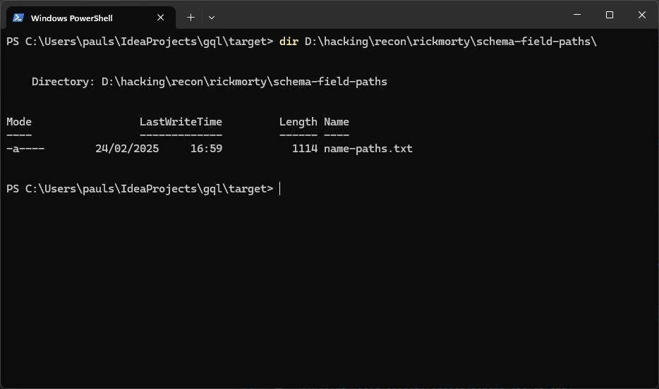

# About - GraphQL Extractor

This is a command line tool which extracts information about GraphQL queries, mutations and subscriptions from schema introspection, remote javascript files and local javascript files.

The functionality of this tool is to extract the following information:
- GraphQL operations (queries, mutations and subscriptions) from javascript files.
- GraphQL requests in json format from javascript files.
- GraphQL unique operation field names.
- GraphQL field paths from introspection schema. Inspired by lupins 'GraphQL is the new PHP' talk (https://www.youtube.com/watch?v=tIo_t5uUK50&t=696s).
- GraphQL field paths from operations found in javascript files.

## Build and installation

Build is based upon GraalVM native-image.

### Prerequisites

- GraalVM for JDK 17 (https://www.oracle.com/java/technologies/downloads/#graalvmjava17)
- GraalVM js language installation
- Microsoft Visual Studio with C++ build tools (https://visualstudio.microsoft.com/visual-cpp-build-tools/)

## Usage

| Arg                | Description                                                                                                                                                                                                                                   |
|--------------------|-----------------------------------------------------------------------------------------------------------------------------------------------------------------------------------------------------------------------------------------------|
| --help             | Outputs usage information                                                                                                                                                                                                                     |
| --input-directory  | The directory containing the javascript files with embedded GQL strings.                                                                                                                                                                      |
| --input-urls       | The path to a wordlist of urls to scan.                                                                                                                                                                                                       |
| --input-schema     | URL to a graphQL endpoint with introspection enabled or the path to a file containing the json response of an introspection query.                                                                                                            |
| --input-operations | The directory containing previously extracted .graphql operations, this avoids resource intensive Javascript AST parsing.                                                                                                                     |
| --request-header   | Request header key/value to set in introspection requests e.g. --request-header="Api-Key1: XXXX" --request-header="Api-Key2: YYYY".                                                                                                           |
| --search-field     | The field name paths to search for in the schema/operations.                                                                                                                                                                                  |
| --depth            | Depth of the field path search, defaults to 10 if not specified.                                                                                                                                                                              |
| --default-params   | The path to a json file of default parameter values. For use with 'requests' output mode                                                                                                                                                      |
| --output-directory | The directory where the generated files will be saved.                                                                                                                                                                                        |
| --output-mode      | The output mode for the generated files. Possible values are 'requests', 'operations', 'fields', 'paths' and 'all'. The default value is 'requests'. Multiple output modes are supported e.g. --output-mode=requests --output-mode=operations |

## Examples

### Schema field search

To search for the possible paths to a field in the schema, use the following command:

```shell
gqlextractor --input-schema=https://rickandmortyapi.com/graphql --search-field=name --output-directory=D:\hacking\recon\rickmorty
```

Example screenshot of the output:


To specify the depth of the search, use the `--depth` argument:

```shell
gqlextractor --input-schema=https://rickandmortyapi.com/graphql --search-field=name --output-directory=D:\hacking\recon\rickmorty --depth=5
```

Example screenshot of the output:


Paths are also saved to a text file based on the name of the field being searched for. e.g.




### Javascript AST processing

Don't have a schema? No problem this tool also works by processing the AST of javascript files (both locally and remotely) to extract GraphQL operations.

Here are some examples of graphql operation formats that are supported

Template string literals:
```javascript
const query = gql`
  query {
    user {
      id
      name
    }
  }
`;
```

String literals:
```javascript
const query = 'query { user { id name } }';
```

Escaped GraphQL document strings:
```javascript
const n=JSON.parse("{\"kind\":\"Document\",\"definitions\":[{\"kind\":\"FragmentDefinition\",\"name\":{\"kind\":\"Name\",
\"value\":\"StoccUser\"},\"typeCondition\":{\"kind\":\"NamedType\",\"name\":{\"kind\":\"Name\",\"value\":\"StoccUser\"}},
\"directives\":[],\"selectionSet\":{\"kind\":\"SelectionSet\",\"selections\":[{\"kind\":\"Field\",
\"name\":{\"kind\":\"Name\",\"value\":\"__typename\"},\"arguments\":[],\"directives\":[]},{\"kind\":\"Field\",
\"name\":{\"kind\":\"Name\",\"value\":\"id\"},\"arguments\":[],\"directives\":[]},{\"kind\":\"Field\",
\"name\":{\"kind\":\"Name\",\"value\":\"email\"},\"arguments\":[],\"directives\":[]},{\"kind\":\"Field\",
\"name\":{\"kind\":\"Name\",\"value\":\"firstName\"},\"arguments\":[],\"directives\":[]},{\"kind\":\"Field\",
\"name\":{\"kind\":\"Name\",\"value\":\"lastName\"},\"arguments\":[],\"directives\":[]},{\"kind\":\"Field\",
\"name\":{\"kind\":\"Name\",\"value\":\"country\"},\"arguments\":[],\"directives\":[]},{\"kind\":\"Field\",
\"name\":{\"kind\":\"Name\",\"value\":\"fullName\"},\"arguments\":[],\"directives\":[]}]}}],
\"definitionId\":\"aaafc494405155bf9a3e5c174a025db9f2db077e9a4931e58ea5d65c7a6da60c\"}")
```

GraphQL documents in javascript objects:
```javascript
i8={kind:"Document",definitions:[{kind:"OperationDefinition",operation:"mutation",name:{kind:"Name",value:"createInstance"},
variableDefinitions:[{kind:"VariableDefinition",variable:{kind:"Variable",name:{kind:"Name",value:"input"}},
type:{kind:"NonNullType",type:{kind:"NamedType",name:{kind:"Name",value:"CreateInstanceInput"}}}}],
selectionSet:{kind:"SelectionSet",selections:[{kind:"Field",name:{kind:"Name",value:"createInstance"},
arguments:[{kind:"Argument",name:{kind:"Name",value:"input"},value:{kind:"Variable",name:{kind:"Name",value:"input"}}}],
selectionSet:{kind:"SelectionSet",selections:[{kind:"Field",name:{kind:"Name",value:"instance"},selectionSet:{kind:"SelectionSet",
selections:[{kind:"FragmentSpread",name:{kind:"Name",value:"instanceFull"}}]}}]}}]}},{kind:"FragmentDefinition",
name:{kind:"Name",value:"instanceFull"},typeCondition:{kind:"NamedType",name:{kind:"Name",value:"Instance"}},
selectionSet:{kind:"SelectionSet",selections:[{kind:"Field",name:{kind:"Name",value:"id"}},{kind:"Field",
name:{kind:"Name",value:"name"}},{kind:"Field",name:{kind:"Name",value:"clientId"}},{kind:"Field",
name:{kind:"Name",value:"createdAt"}}]}}]}
```

#### Extracting operations from javascript files

This mode will extract GraphQL operations (queries, mutations and subscriptions) from all of the above formats in javascript files.

